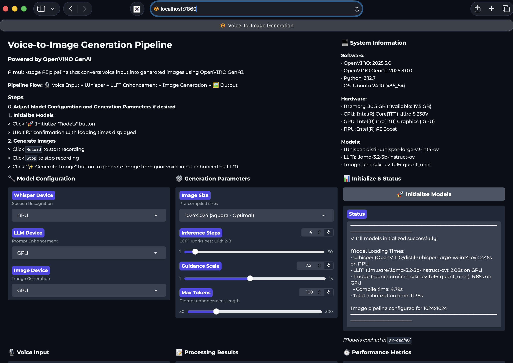
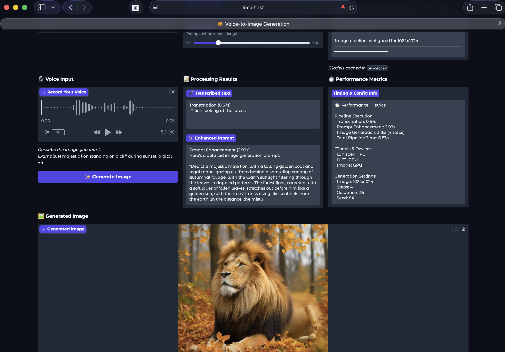

# 🎤 Voice-to-Image Generation Pipeline

A multi-stage AI pipeline that converts voice input into generated images using [OpenVINO GenAI](https://docs.openvino.ai/).

## 🌟 Features

- **Voice Input**: Speak naturally to describe the image you want
- **Speech Recognition**: Whisper (configurable)
- **Prompt Enhancement**: LLaMA 3.2 3B Instruct (configurable)
- **Image Generation**: LCM-SDXL (configurable)
- **Device Flexibility**: Choose CPU, GPU, or NPU for each model independently
- **Model Caching**: Pre-compiled models for fast loading
- **Performance Metrics**: Detailed timing and system information
- **Centralized Configuration**: Single `models.config` file for all settings

## 📋 Pipeline Flow

```
🎙️ Voice Input → Whisper → LLM Enhancement → Image Generation → 🖼️ Output
```

## Screenshots

<table>
  <tr>
    <td width="50%"></td>
    <td width="50%"></td>
  </tr>
</table>

## 🚀 Quick Start

### Prerequisites

- [OpenVINO GenAI](https://docs.openvino.ai/2025/get-started/install-openvino.html)
- [Intel NPU drivers (for NPU acceleration)](https://docs.openvino.ai/2025/get-started/install-openvino/configurations.html)
- [Intel GPU drivers (for GPU acceleration)](https://docs.openvino.ai/2025/get-started/install-openvino/configurations.html)

### Setup 

The easiest way to get started is with the combined setup script:

- All models are configured in `models.config`:
- **To change models:** Simply edit the `*_hf_id` values and run `python setup_models.py` again. Local directory names are automatically generated from the model names.

```bash
# Clone or navigate to the project directory
git clone https://github.com/ravi9/voice-to-image-ov-genai-demo.git
cd voice-to-image-ov-genai-demo

# Create and activate virtual environment
python -m venv v2i-env
source v2i-env/bin/activate  # Linux/Mac
# or
v2i-env\Scripts\activate     # Windows

# Install dependencies
pip install -r requirements.txt

# Download AND pre-compile models in one step
python setup_models.py
```

This will:
1. Download all 3 models from HuggingFace (~14-15 GB)
2. Pre-compile them for your selected devices
3. Cache compiled models for fast loading
4. Test each model to ensure it works


### Running the Application

```bash
python voice-to-image-app.py
```

> [!NOTE] The application will start at: `http://localhost:7860`


## Usage
0. **Adjust Model Configuration and Generation Parameters if desired**
1. **Initialize Models**:
   - Click "🚀 Initialize Models" button
   - Wait for confirmation with loading times displayed

2. **Generate Images**:
   - Click `Record` to start recording. Example: *"A majestic lion standing on cliff at sunset"*
   - Click `Stop` to stop recording
   - Click "✨ Generate Image" button to generate image from your voice input enhanced by LLM.

### Sample Output:
```console
$ python voice-to-image-app.py 
======================================================================
VOICE-TO-IMAGE GENERATION APP
======================================================================

📊 System Information:
• Platform: Linux 6.11.0-26-generic
• Python: 3.12.7
• OpenVINO: 2025.3.0
• OpenVINO GenAI: 2025.3.0.0

🔧 Available Hardware:
• Devices: CPU, GPU, NPU
  - CPU: Intel(R) Core(TM) Ultra 5 238V
  - GPU: Intel(R) Arc(TM) Graphics (iGPU)
  - NPU: Intel(R) AI Boost

📦 Model Configuration:
• Whisper: OpenVINO/distil-whisper-large-v3-int4-ov
• LLM: llmware/llama-3.2-3b-instruct-ov
• Image: rpanchum/lcm-sdxl-ov-fp16-quant_unet

📁 Paths:
• Config file: /home/ubuntu/projects/voice-to-image-ov-genai-demo/models.config
• Models directory: /home/ubuntu/projects/voice-to-image-ov-genai-demo/models
• Cache directory: /home/ubuntu/projects/voice-to-image-ov-genai-demo/ov-cache

✓ Model cache found. Models will load quickly from cache.

======================================================================
Starting Gradio interface...
======================================================================

* Running on local URL:  http://0.0.0.0:7860
* To create a public link, set `share=True` in `launch()`.
Loading Whisper model (OpenVINO/distil-whisper-large-v3-int4-ov) on NPU...
Using cache directory: /home/ubuntu/projects/voice-to-image-ov-genai-demo/ov-cache/npucache
✓ Whisper loaded in 2.45 seconds
Loading LLM model (llmware/llama-3.2-3b-instruct-ov) on GPU...
Using cache directory: /home/ubuntu/projects/voice-to-image-ov-genai-demo/ov-cache/gpucache
✓ LLM loaded in 2.08 seconds
Loading Image Generation model (rpanchum/lcm-sdxl-ov-fp16-quant_unet) on GPU...
Image dimensions: 1024x1024
Reshaping pipeline for 1024x1024...
Compiling pipeline on GPU with cache: /home/ubuntu/projects/voice-to-image-ov-genai-demo/ov-cache/gpucache
✓ Image compile time: 4.79 seconds
✓ Image total load time: 6.85 seconds

━━━━━━━━━━━━━━━━━━━━━━━━━━━━━━━━━━━━━━━━━━━━
✓ All models initialized successfully!
        
Model Loading Times:
• Whisper (OpenVINO/distil-whisper-large-v3-int4-ov): 2.45s on NPU
• LLM (llmware/llama-3.2-3b-instruct-ov): 2.08s on GPU
• Image (rpanchum/lcm-sdxl-ov-fp16-quant_unet): 6.85s on GPU
  - Compile time: 4.79s
• Total initialization time: 11.38s

Image pipeline configured for 1024x1024
━━━━━━━━━━━━━━━━━━━━━━━━━━━━━━━━━━━━━━━━━━━━
Transcribing audio...
Transcription:  A lion looking at the forest.
Transcription time: 0.67s
Enhancing prompt...
Enhanced prompt: Here's a detailed image generation prompt:

"Depict a majestic male lion, with a tawny golden coat and regal mane, gazing out from behind a sprawling canopy of autumnal foliage, with the warm sunlight filtering through the leaves in dappled patterns. The forest floor, carpeted with a soft layer of fallen leaves, stretches out before him like a golden sea, with the trees' trunks rising like sentinels from the earth. In the distance, the misty
Prompt enhancement time: 2.99s
Generating image...
Using random seed: 84
Image generation time: 3.16s
Image generation complete!
```


## Advanced Configuration

### Setup Script Options

```bash
# Full setup with default devices (Whisper: NPU, LLM & Image: GPU)
python setup_models.py

# Custom devices (long form)
python setup_models.py --whisper-device NPU --llm-device GPU --image-device GPU

# Custom devices (shorthand notation)
python setup_models.py -w NPU -l GPU -i GPU

# Download only (skip compilation)
python setup_models.py --download-only

# Compile only (skip download)
python setup_models.py --compile-only

# Single image size (faster setup)
python setup_models.py --single-size

# View all options
python setup_models.py --help
```

**Usage:**
```bash
$ python setup_models.py -h
usage: setup_models.py [-h] [--whisper-device {CPU,GPU,NPU}] [--llm-device {CPU,GPU,NPU}] [--image-device {CPU,GPU,NPU}] [--download-only] [--compile-only] [--single-size]

Complete setup for Voice-to-Image Pipeline (Download + Compile)

options:
  -h, --help            show this help message and exit
  --whisper-device {CPU,GPU,NPU}, -w {CPU,GPU,NPU}
                        Device for Whisper model (default: NPU)
  --llm-device {CPU,GPU,NPU}, -l {CPU,GPU,NPU}
                        Device for LLM model (default: GPU)
  --image-device {CPU,GPU,NPU}, -i {CPU,GPU,NPU}
                        Device for Image Generation model (default: GPU)
  --download-only, -d   Only download models, skip compilation
  --compile-only, -c    Only compile models, skip download
  --single-size, -s     Compile image pipeline for single size (1024x1024) instead of multiple sizes
```

### Model Caching

The application uses OpenVINO's model caching for fast loading:
- **First time**: Models are compiled and cached (10-30 minutes)
- **Subsequent loads**: Models load from cache (seconds)
- Separate cache for each device type (CPU/GPU/NPU)
- Image pipeline cached per size (512x512, 1024x1024, 1024x768)
- Cache location: `ov-cache/cpucache`, `ov-cache/gpucache`, `ov-cache/npucache`
